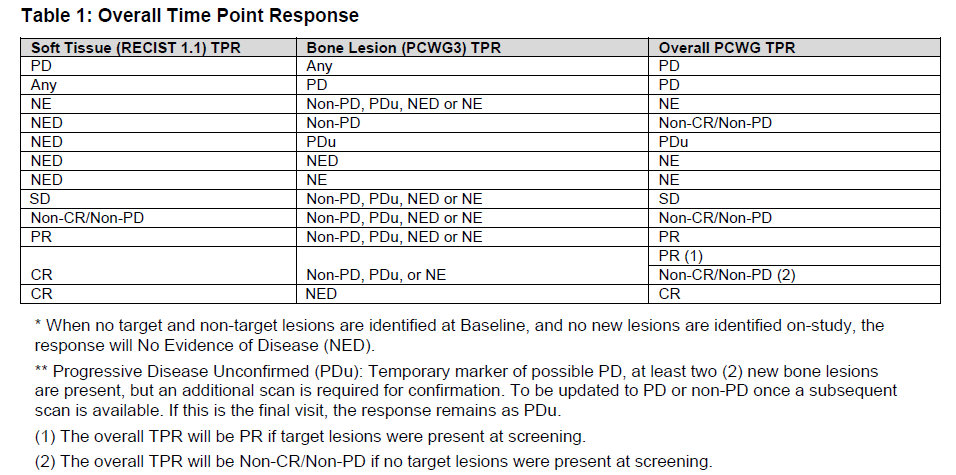

# 1 前列腺癌简介

前列腺癌是常见的泌尿系统恶性肿瘤，在世界范围内发病率位居男性恶性肿瘤的第二位。

根据雄激素剥夺治疗的敏感性及是否发生远处转移分为：

1.  转移性激素敏感性前列腺癌（mHSPC）

2.  转移性去势抵抗性前列腺癌（mCRPC-Metastatic Castration-Resistant Prostate Cancer）

3.  非转移性去势抵抗性前列腺癌（nmCRPC-Non-Metastatic Castration-Resistant Prostate Cancer）

前列腺治疗大多数依赖雄激素生长，降低雄激素能抑制肿瘤生长。但去势抵抗性前列腺癌意思是虽然把雄激素水平降到很低，但肿瘤仍然在继续发展，这就叫CRPC。那什么事nmCRPC呢，nmCRPC，非转移性去势抵抗性前列腺癌，意思是虽然肿瘤变坏了，但还没跑到其他器官。那相比nmCRPC，mCRPC多了一个转移性，意思是说患者已经发生远处转移了。

前列腺癌进展相对缓慢（生长速度慢、疾病进展慢、生存时间长），如nmCRPC患者中位总生存期近5年，如果将OS作为临床试验终点，那么临床试验必须等到足够多的患者死亡后才能得到结果。对于进展较缓慢的前列腺癌，这个过程可能需要很多年，因此新药上市和患者获益的时间都会被推迟。

但是，前列腺癌独特的疾病特征如高发的骨转移，因此可以采用替代终点（Surrogate Endpoint），如：影像学无进展生存期（Radiographic Progression Free Survival，rPFS）

# 2 PCWG3（Prostate Cancer Clinical Trials Working Group3）

对于前列腺癌患者，PCWG3建议用RECIST1.1评估非骨病灶，用PCWG3评估骨病灶，最后，结合该受试者的所有病灶（非骨病灶,RECIST1.1+骨病灶,PCWG3）衍生TPR（PCWG3 time point response）

### 2.1 TPR（PCWG3 time point response）

疾病进展的时间是Overall PCWG TPR为PD的时间-类似RSDTC（需要程序员自己衍生）。

BOR（best overall response）基于TPR判定，CR和PR需要确认？

# 2 前列腺癌主要终点

## 2.1 影像学无进展生存期（Radiographic Progression Free Survival，rPFS）

通常实体瘤采用常规RECIST1.1标准评估肿瘤缓解或进展。晚期前列腺癌有较高比例的骨转移病灶，按照RECIST1.1评价骨转移病灶通常归为不可测量病灶，不作为靶病灶进行评估，而是通过骨扫描采样PCWG3标准进展评价。

::: callout-note
**RECIST1.1对于骨病灶相关的描述：**

**不可测量病灶：**无可测量软组织成分的骨病灶

**含软组织成分的骨病灶：**CT或MRI上可见的溶骨性病灶或混合性骨病灶，其软组织部分符合可测量定义，且适合重复测量的，在没有其他软组织病灶可选时，可选为靶病灶。仅在骨扫描、PET或X线检查中发现的骨病灶不作为靶病灶。

**无软组织成分的骨病灶：**鉴于图像对骨化和成骨性肿瘤的鉴别能力方面的限制，骨性病灶应被选为非靶病灶。
:::

rPFS定义为自随机日期开始至出现影像学进展或任何原因导致死亡是时间，影像学进展包括根据RECIST1.1标准和PCWG3标准，对原发病灶、区域淋巴结侵犯、软组织转移和骨转移病灶进展情况的评价。

## 2.2 无转移生存期（Metastasis-Free Survival, MFS）

MFS定义为随机化至出现远处转移证据或任何原因死亡的时间。需在MFS定义中明确转移性疾病（骨转移、内脏转移、远处淋巴结转移）的定义。该定义应排除局部疾病进展时间（例如主动脉分叉以下的盆腔淋巴结）。

## 2.3 基于PSA水平的终点

PSA升高在临床实践中被视为前列腺癌进展的早期信号，是敏感性肿瘤标志物。

### 2.3.1 PSA50、PSA90缓解率

PSA水平从基线至基线后下降≥50%或≥90%，并且由至少3周后再次评估确定PSA缓解。PSA缓解率通常将在某个时间点PSA下降≥50%或≥90%的患者比例作为评估指标。

### 2.3.2 至首发症状性骨相关事件（Symptomatic Skeletal Event,SSE）时间

定义为随机至首次发生SSE的时间，SSE包括使用外照射放射治疗来预防或缓解骨骼症状、出现新发症状性病理性骨折，出现脊髓压迫等。

## 2.4 小结

对于不同的基本阶段可考虑选择合理的替代终点，例如未经治疗的mCRPC和mHSPC患者可选择rPFS作为主要终点，OS作为关键次要终点。nmCRPC可选择MFS作为主要终点。

按照PCWG3标准，影像学结巴进展的骨转移需要进行确认。受试者可能在骨转移病灶再次进行影像学确认前脱落，导致骨转移病灶进展确证性数据缺失。